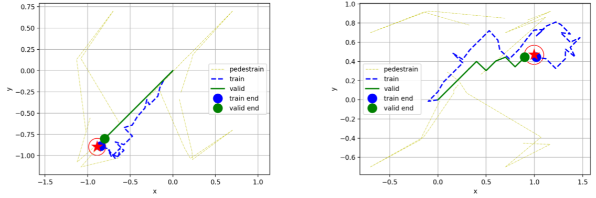

# MAML-SA: Robot Navigation in crowds

This repository was built for the Stanford CS234 course project "Robot Navigation in Crowds via Meta-learning". Two major changes were made to the pytorch implementation of MAML RL ([here](https://github.com/tristandeleu/pytorch-maml-rl)): 1) a new policy network capable of extracting features regarding robot-human pairwise interactions; 2) a new environment that simulates a dense crowd and returns the environmental response given an action.

# Abstract
In this work, we propose a robot navigation policy network what is compatible with the meta-learning framework. The robot is expected to efficiently navigate in a pedestrian-rich environment with randomly assigned goals. It needs to adapt to different pedestrian speeds and traveling directions while minimizing collision rates. The proposed policy network enables the robot to be aware of the crowd with attention-based human-behavior-capture mechanism. The meta-learning framework tackles the uncertainties of the environment, and maintains the awareness of unobservable human control policies implicitly. As a result, the robot has a higher efficiency in navigating towards the assigned goal while avoiding the pedestrians with the proposed policy network as compared to an implementation of the meta-learning method for general reinforcement learning applications.

  

Pre-update policy (blue) VS. one-step gradient update policy (green):
  

Changes made for the application of this project are reflected in the Github repository as

A new environment file named navRVO2_all.py was added to ./maml_rl/envs/ and a new policy file was replacing the original normal_mlp.py in ./maml_rl/policices/. Also, two new files were added to the repository: main_test.py and make_traj_anim.py. main_test.py is used for evaluating the performance of a trained policy network through task-specific gradient updates. make_traj_anim.py is used to plot and animiate the scene of robot navigation in crowds. Other files were edited accordingly. Please refer to the [home](https://github.com/tristandeleu/pytorch-maml-rl) of the original Pytorch imeplementation of MAML for the usage of the code (MuJoCo is not used).

# References:
Finn, Chelsea, Pieter Abbeel, and Sergey Levine. "Model-agnostic meta-learning for fast adaptation of deep networks." Proceedings of the 34th International Conference on Machine Learning-Volume 70. JMLR. org, 2017.

Chen, Changan, et al. "Crowd-Robot Interaction: Crowd-aware Robot Navigation with Attention-based Deep Reinforcement Learning." arXiv preprint arXiv:1809.08835 (2018).

Van den Berg, Jur, Ming Lin, and Dinesh Manocha. "Reciprocal velocity obstacles for real-time multi-agent navigation." 2008 IEEE International Conference on Robotics and Automation. IEEE, 2008.
